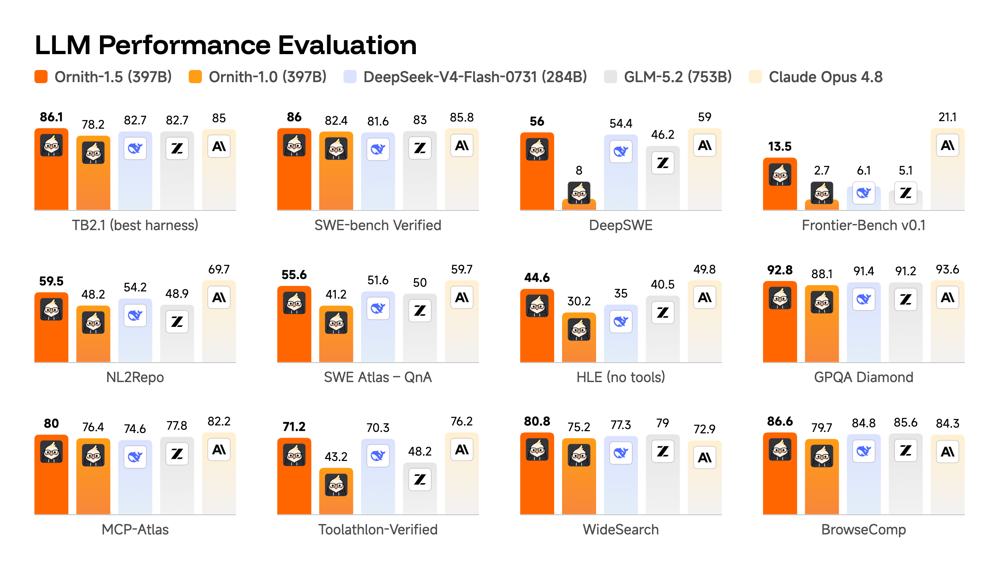

<div align="center">

</div>
<div align="center">

[](https://ornith.ai/ornith_1_0.html)
&nbsp;<sup>|</sup>&nbsp;
[](https://ornith.ai/ornith_1_5.html)

</div>

---

# Ornith

Aloha! 🌺 **Ornith** is a family of self-improving open-source models for agentic tasks. This repo covers both generations:

- 🐦 [**Ornith-1.5**](#ornith-15) *(latest)* — extends self-scaffolding into a complete end-to-end **self-improvement loop**: the model proposes new tasks, generates task-specific scaffolds, and produces solution rollouts for reinforcement learning. Model weights at [HuggingFace](https://huggingface.co/collections/ornith-ai/ornith-15), and more details can be found at [blog](https://ornith.ai/ornith_1_5.html).
- 🐦 [**Ornith-1.0**](#ornith-10) — the first release, which jointly optimizes the scaffold and the resulting solution rollouts. Model weights at [HuggingFace](https://huggingface.co/collections/ornith-ai/ornith-10), and more details can be found at [blog](https://ornith.ai/ornith_1_0.html).

Both generations are **MIT licensed, globally accessible, and free from regional limitations**.




## Benchmarks


### 397B

<div style="font-family:-apple-system,BlinkMacSystemFont,'Segoe UI',Roboto,sans-serif;width:100%;margin:0 auto;padding:16px 0">
<table style="width:100%;table-layout:fixed;border-collapse:collapse;font-size:13px">
<thead><tr>
<th style="width:24%;padding:10px 7px;text-align:left;font-weight:600;border-bottom:2px solid #FD8E5B;color:#FD8E5B"></th>
<th align="center" style="width:12.67%;padding:10px 7px;text-align:center;font-weight:700;border-bottom:2px solid #FD8E5B;color:#FD8E5B;font-size:14px;background:rgba(253, 142, 91, 0.12)">Ornith-1.5-397B</th>
<th align="center" style="width:12.67%;padding:10px 7px;text-align:center;font-weight:600;border-bottom:2px solid #FD8E5B;color:#FD8E5B;font-size:14px;background:rgba(253, 142, 91, 0.05)">Ornith-1.0-397B</th>
<th align="center" style="width:12.67%;padding:10px 7px;text-align:center;font-weight:500;border-bottom:2px solid #FD8E5B;color:#FD8E5B;font-size:14px;">DeepSeek-V4-Flash-0731 <sub><small>(284B)</small></sub></th>
<th align="center" style="width:12.67%;padding:10px 7px;text-align:center;font-weight:500;border-bottom:2px solid #FD8E5B;color:#FD8E5B;font-size:14px;">GLM-5.2 <sub><small>(753B)</small></sub></th>
<th align="center" style="width:12.67%;padding:10px 7px;text-align:center;font-weight:500;border-bottom:2px solid #FD8E5B;color:#FD8E5B;font-size:14px;">Claude Opus 4.8</th>
<th align="center" style="width:12.67%;padding:10px 7px;text-align:center;font-weight:500;border-bottom:2px solid #FD8E5B;color:#FD8E5B;font-size:14px;">Kimi K3 <sub><small>(2.8T)</small></sub></th>
</tr></thead>
<tbody>
<tr><td colspan="7" style="padding:8px 12px;font-weight:600;color:#FD8E5B;border-bottom:1px solid rgba(253, 142, 91, 0.2);background:rgba(253, 142, 91, 0.1)">Coding</td></tr>
<tr><td style="padding:7px 7px;padding-left:20px;border-bottom:1px solid rgba(128, 128, 128, 0.15);">Terminal-Bench 2.1 <sub><small>(Terminus-2)</small></sub></td><td align="center" style="padding:7px 7px;text-align:center;border-bottom:1px solid rgba(128, 128, 128, 0.15);font-weight:600;color:#FD8E5B;background:rgba(253, 142, 91, 0.06)">86.1</td><td align="center" style="padding:7px 7px;text-align:center;border-bottom:1px solid rgba(128, 128, 128, 0.15);color:#FD8E5B;background:rgba(253, 142, 91, 0.03)">77.5</td><td align="center" style="padding:7px 7px;text-align:center;border-bottom:1px solid rgba(128, 128, 128, 0.15)">82.7</td><td align="center" style="padding:7px 7px;text-align:center;border-bottom:1px solid rgba(128, 128, 128, 0.15)">81</td><td align="center" style="padding:7px 7px;text-align:center;border-bottom:1px solid rgba(128, 128, 128, 0.15)">85</td><td align="center" style="padding:7px 7px;text-align:center;border-bottom:1px solid rgba(128, 128, 128, 0.15)">88.3</td></tr>
<tr><td style="padding:7px 7px;padding-left:20px;border-bottom:1px solid rgba(128, 128, 128, 0.15);">Terminal-Bench 2.1 <sub><small>(Claude Code)</small></sub></td><td align="center" style="padding:7px 7px;text-align:center;border-bottom:1px solid rgba(128, 128, 128, 0.15);font-weight:600;color:#FD8E5B;background:rgba(253, 142, 91, 0.06)">85.2</td><td align="center" style="padding:7px 7px;text-align:center;border-bottom:1px solid rgba(128, 128, 128, 0.15);color:#FD8E5B;background:rgba(253, 142, 91, 0.03)">78.2</td><td align="center" style="padding:7px 7px;text-align:center;border-bottom:1px solid rgba(128, 128, 128, 0.15)">81.8</td><td align="center" style="padding:7px 7px;text-align:center;border-bottom:1px solid rgba(128, 128, 128, 0.15)">82.7</td><td align="center" style="padding:7px 7px;text-align:center;border-bottom:1px solid rgba(128, 128, 128, 0.15)">78.9</td><td align="center" style="padding:7px 7px;text-align:center;border-bottom:1px solid rgba(128, 128, 128, 0.15)">-</td></tr>
<tr><td style="padding:7px 7px;padding-left:20px;border-bottom:1px solid rgba(128, 128, 128, 0.15);">SWE-bench Verified</td><td align="center" style="padding:7px 7px;text-align:center;border-bottom:1px solid rgba(128, 128, 128, 0.15);font-weight:600;color:#FD8E5B;background:rgba(253, 142, 91, 0.06)">86</td><td align="center" style="padding:7px 7px;text-align:center;border-bottom:1px solid rgba(128, 128, 128, 0.15);color:#FD8E5B;background:rgba(253, 142, 91, 0.03)">82.4</td><td align="center" style="padding:7px 7px;text-align:center;border-bottom:1px solid rgba(128, 128, 128, 0.15)">81.6</td><td align="center" style="padding:7px 7px;text-align:center;border-bottom:1px solid rgba(128, 128, 128, 0.15)">83</td><td align="center" style="padding:7px 7px;text-align:center;border-bottom:1px solid rgba(128, 128, 128, 0.15)">85.8</td><td align="center" style="padding:7px 7px;text-align:center;border-bottom:1px solid rgba(128, 128, 128, 0.15)">86.2</td></tr>
<tr><td style="padding:7px 7px;padding-left:20px;border-bottom:1px solid rgba(128, 128, 128, 0.15);">SWE-bench Pro</td><td align="center" style="padding:7px 7px;text-align:center;border-bottom:1px solid rgba(128, 128, 128, 0.15);font-weight:600;color:#FD8E5B;background:rgba(253, 142, 91, 0.06)">65.1</td><td align="center" style="padding:7px 7px;text-align:center;border-bottom:1px solid rgba(128, 128, 128, 0.15);color:#FD8E5B;background:rgba(253, 142, 91, 0.03)">62.2</td><td align="center" style="padding:7px 7px;text-align:center;border-bottom:1px solid rgba(128, 128, 128, 0.15)">64.4</td><td align="center" style="padding:7px 7px;text-align:center;border-bottom:1px solid rgba(128, 128, 128, 0.15)">62.1</td><td align="center" style="padding:7px 7px;text-align:center;border-bottom:1px solid rgba(128, 128, 128, 0.15)">68</td><td align="center" style="padding:7px 7px;text-align:center;border-bottom:1px solid rgba(128, 128, 128, 0.15)">-</td></tr>
<tr><td style="padding:7px 7px;padding-left:20px;border-bottom:1px solid rgba(128, 128, 128, 0.15);">SWE-bench Multilingual</td><td align="center" style="padding:7px 7px;text-align:center;border-bottom:1px solid rgba(128, 128, 128, 0.15);font-weight:600;color:#FD8E5B;background:rgba(253, 142, 91, 0.06)">79.6</td><td align="center" style="padding:7px 7px;text-align:center;border-bottom:1px solid rgba(128, 128, 128, 0.15);color:#FD8E5B;background:rgba(253, 142, 91, 0.03)">78.9</td><td align="center" style="padding:7px 7px;text-align:center;border-bottom:1px solid rgba(128, 128, 128, 0.15)">77.9</td><td align="center" style="padding:7px 7px;text-align:center;border-bottom:1px solid rgba(128, 128, 128, 0.15)">78.4</td><td align="center" style="padding:7px 7px;text-align:center;border-bottom:1px solid rgba(128, 128, 128, 0.15)">75.7</td><td align="center" style="padding:7px 7px;text-align:center;border-bottom:1px solid rgba(128, 128, 128, 0.15)">-</td></tr>
<tr><td style="padding:7px 7px;padding-left:20px;border-bottom:1px solid rgba(128, 128, 128, 0.15);">DeepSWE</td><td align="center" style="padding:7px 7px;text-align:center;border-bottom:1px solid rgba(128, 128, 128, 0.15);font-weight:600;color:#FD8E5B;background:rgba(253, 142, 91, 0.06)">56</td><td align="center" style="padding:7px 7px;text-align:center;border-bottom:1px solid rgba(128, 128, 128, 0.15);color:#FD8E5B;background:rgba(253, 142, 91, 0.03)">8</td><td align="center" style="padding:7px 7px;text-align:center;border-bottom:1px solid rgba(128, 128, 128, 0.15)">54.4</td><td align="center" style="padding:7px 7px;text-align:center;border-bottom:1px solid rgba(128, 128, 128, 0.15)">46.2</td><td align="center" style="padding:7px 7px;text-align:center;border-bottom:1px solid rgba(128, 128, 128, 0.15)">59</td><td align="center" style="padding:7px 7px;text-align:center;border-bottom:1px solid rgba(128, 128, 128, 0.15)">67.5</td></tr>
<tr><td style="padding:7px 7px;padding-left:20px;border-bottom:1px solid rgba(128, 128, 128, 0.15);">Frontier-Bench v0.1</td><td align="center" style="padding:7px 7px;text-align:center;border-bottom:1px solid rgba(128, 128, 128, 0.15);font-weight:600;color:#FD8E5B;background:rgba(253, 142, 91, 0.06)">13.5</td><td align="center" style="padding:7px 7px;text-align:center;border-bottom:1px solid rgba(128, 128, 128, 0.15);color:#FD8E5B;background:rgba(253, 142, 91, 0.03)">2.7</td><td align="center" style="padding:7px 7px;text-align:center;border-bottom:1px solid rgba(128, 128, 128, 0.15)">6.1</td><td align="center" style="padding:7px 7px;text-align:center;border-bottom:1px solid rgba(128, 128, 128, 0.15)">5.1</td><td align="center" style="padding:7px 7px;text-align:center;border-bottom:1px solid rgba(128, 128, 128, 0.15)">21.1</td><td align="center" style="padding:7px 7px;text-align:center;border-bottom:1px solid rgba(128, 128, 128, 0.15)">23</td></tr>
<tr><td style="padding:7px 7px;padding-left:20px;border-bottom:1px solid rgba(128, 128, 128, 0.15);">NL2Repo</td><td align="center" style="padding:7px 7px;text-align:center;border-bottom:1px solid rgba(128, 128, 128, 0.15);font-weight:600;color:#FD8E5B;background:rgba(253, 142, 91, 0.06)">59.5</td><td align="center" style="padding:7px 7px;text-align:center;border-bottom:1px solid rgba(128, 128, 128, 0.15);color:#FD8E5B;background:rgba(253, 142, 91, 0.03)">48.2</td><td align="center" style="padding:7px 7px;text-align:center;border-bottom:1px solid rgba(128, 128, 128, 0.15)">54.2</td><td align="center" style="padding:7px 7px;text-align:center;border-bottom:1px solid rgba(128, 128, 128, 0.15)">48.9</td><td align="center" style="padding:7px 7px;text-align:center;border-bottom:1px solid rgba(128, 128, 128, 0.15)">69.7</td><td align="center" style="padding:7px 7px;text-align:center;border-bottom:1px solid rgba(128, 128, 128, 0.15)">-</td></tr>
<tr><td style="padding:7px 7px;padding-left:20px;border-bottom:1px solid rgba(128, 128, 128, 0.15);">SWE Atlas - QnA</td><td align="center" style="padding:7px 7px;text-align:center;border-bottom:1px solid rgba(128, 128, 128, 0.15);font-weight:600;color:#FD8E5B;background:rgba(253, 142, 91, 0.06)">55.6</td><td align="center" style="padding:7px 7px;text-align:center;border-bottom:1px solid rgba(128, 128, 128, 0.15);color:#FD8E5B;background:rgba(253, 142, 91, 0.03)">41.2</td><td align="center" style="padding:7px 7px;text-align:center;border-bottom:1px solid rgba(128, 128, 128, 0.15)">51.6</td><td align="center" style="padding:7px 7px;text-align:center;border-bottom:1px solid rgba(128, 128, 128, 0.15)">50</td><td align="center" style="padding:7px 7px;text-align:center;border-bottom:1px solid rgba(128, 128, 128, 0.15)">59.7</td><td align="center" style="padding:7px 7px;text-align:center;border-bottom:1px solid rgba(128, 128, 128, 0.15)">59.7</td></tr>
<tr><td colspan="7" style="padding:8px 12px;font-weight:600;color:#FD8E5B;border-bottom:1px solid rgba(253, 142, 91, 0.2);background:rgba(253, 142, 91, 0.1)">Reasoning</td></tr>
<tr><td style="padding:7px 7px;padding-left:20px;border-bottom:1px solid rgba(128, 128, 128, 0.15);">HLE <sub><small>(no tools)</small></sub></td><td align="center" style="padding:7px 7px;text-align:center;border-bottom:1px solid rgba(128, 128, 128, 0.15);font-weight:600;color:#FD8E5B;background:rgba(253, 142, 91, 0.06)">44.6</td><td align="center" style="padding:7px 7px;text-align:center;border-bottom:1px solid rgba(128, 128, 128, 0.15);color:#FD8E5B;background:rgba(253, 142, 91, 0.03)">30.2</td><td align="center" style="padding:7px 7px;text-align:center;border-bottom:1px solid rgba(128, 128, 128, 0.15)">35</td><td align="center" style="padding:7px 7px;text-align:center;border-bottom:1px solid rgba(128, 128, 128, 0.15)">40.5</td><td align="center" style="padding:7px 7px;text-align:center;border-bottom:1px solid rgba(128, 128, 128, 0.15)">49.8</td><td align="center" style="padding:7px 7px;text-align:center;border-bottom:1px solid rgba(128, 128, 128, 0.15)">43.5</td></tr>
<tr><td style="padding:7px 7px;padding-left:20px;border-bottom:1px solid rgba(128, 128, 128, 0.15);">HLE <sub><small>(with tools)</small></sub></td><td align="center" style="padding:7px 7px;text-align:center;border-bottom:1px solid rgba(128, 128, 128, 0.15);font-weight:600;color:#FD8E5B;background:rgba(253, 142, 91, 0.06)">56.1</td><td align="center" style="padding:7px 7px;text-align:center;border-bottom:1px solid rgba(128, 128, 128, 0.15);color:#FD8E5B;background:rgba(253, 142, 91, 0.03)">47.5</td><td align="center" style="padding:7px 7px;text-align:center;border-bottom:1px solid rgba(128, 128, 128, 0.15)">50.8</td><td align="center" style="padding:7px 7px;text-align:center;border-bottom:1px solid rgba(128, 128, 128, 0.15)">54.7</td><td align="center" style="padding:7px 7px;text-align:center;border-bottom:1px solid rgba(128, 128, 128, 0.15)">57.9</td><td align="center" style="padding:7px 7px;text-align:center;border-bottom:1px solid rgba(128, 128, 128, 0.15)">56</td></tr>
<tr><td style="padding:7px 7px;padding-left:20px;border-bottom:1px solid rgba(128, 128, 128, 0.15);">GPQA Diamond</td><td align="center" style="padding:7px 7px;text-align:center;border-bottom:1px solid rgba(128, 128, 128, 0.15);font-weight:600;color:#FD8E5B;background:rgba(253, 142, 91, 0.06)">92.8</td><td align="center" style="padding:7px 7px;text-align:center;border-bottom:1px solid rgba(128, 128, 128, 0.15);color:#FD8E5B;background:rgba(253, 142, 91, 0.03)">88.1</td><td align="center" style="padding:7px 7px;text-align:center;border-bottom:1px solid rgba(128, 128, 128, 0.15)">91.4</td><td align="center" style="padding:7px 7px;text-align:center;border-bottom:1px solid rgba(128, 128, 128, 0.15)">91.2</td><td align="center" style="padding:7px 7px;text-align:center;border-bottom:1px solid rgba(128, 128, 128, 0.15)">93.6</td><td align="center" style="padding:7px 7px;text-align:center;border-bottom:1px solid rgba(128, 128, 128, 0.15)">93.5</td></tr>
<tr><td colspan="7" style="padding:8px 12px;font-weight:600;color:#FD8E5B;border-bottom:1px solid rgba(253, 142, 91, 0.2);background:rgba(253, 142, 91, 0.1)">Agentic</td></tr>
<tr><td style="padding:7px 7px;padding-left:20px;border-bottom:1px solid rgba(128, 128, 128, 0.15);">MCP-Atlas</td><td align="center" style="padding:7px 7px;text-align:center;border-bottom:1px solid rgba(128, 128, 128, 0.15);font-weight:600;color:#FD8E5B;background:rgba(253, 142, 91, 0.06)">80</td><td align="center" style="padding:7px 7px;text-align:center;border-bottom:1px solid rgba(128, 128, 128, 0.15);color:#FD8E5B;background:rgba(253, 142, 91, 0.03)">76.4</td><td align="center" style="padding:7px 7px;text-align:center;border-bottom:1px solid rgba(128, 128, 128, 0.15)">74.6</td><td align="center" style="padding:7px 7px;text-align:center;border-bottom:1px solid rgba(128, 128, 128, 0.15)">77.8</td><td align="center" style="padding:7px 7px;text-align:center;border-bottom:1px solid rgba(128, 128, 128, 0.15)">82.2</td><td align="center" style="padding:7px 7px;text-align:center;border-bottom:1px solid rgba(128, 128, 128, 0.15)">82.3</td></tr>
<tr><td style="padding:7px 7px;padding-left:20px;border-bottom:1px solid rgba(128, 128, 128, 0.15);">Toolathlon-Verified</td><td align="center" style="padding:7px 7px;text-align:center;border-bottom:1px solid rgba(128, 128, 128, 0.15);font-weight:600;color:#FD8E5B;background:rgba(253, 142, 91, 0.06)">71.2</td><td align="center" style="padding:7px 7px;text-align:center;border-bottom:1px solid rgba(128, 128, 128, 0.15);color:#FD8E5B;background:rgba(253, 142, 91, 0.03)">43.2</td><td align="center" style="padding:7px 7px;text-align:center;border-bottom:1px solid rgba(128, 128, 128, 0.15)">70.3</td><td align="center" style="padding:7px 7px;text-align:center;border-bottom:1px solid rgba(128, 128, 128, 0.15)">48.2</td><td align="center" style="padding:7px 7px;text-align:center;border-bottom:1px solid rgba(128, 128, 128, 0.15)">76.2</td><td align="center" style="padding:7px 7px;text-align:center;border-bottom:1px solid rgba(128, 128, 128, 0.15)">73.2</td></tr>
<tr><td style="padding:7px 7px;padding-left:20px;border-bottom:1px solid rgba(128, 128, 128, 0.15);">WideSearch</td><td align="center" style="padding:7px 7px;text-align:center;border-bottom:1px solid rgba(128, 128, 128, 0.15);font-weight:600;color:#FD8E5B;background:rgba(253, 142, 91, 0.06)">80.8</td><td align="center" style="padding:7px 7px;text-align:center;border-bottom:1px solid rgba(128, 128, 128, 0.15);color:#FD8E5B;background:rgba(253, 142, 91, 0.03)">75.2</td><td align="center" style="padding:7px 7px;text-align:center;border-bottom:1px solid rgba(128, 128, 128, 0.15)">77.3</td><td align="center" style="padding:7px 7px;text-align:center;border-bottom:1px solid rgba(128, 128, 128, 0.15)">79</td><td align="center" style="padding:7px 7px;text-align:center;border-bottom:1px solid rgba(128, 128, 128, 0.15)">72.9</td><td align="center" style="padding:7px 7px;text-align:center;border-bottom:1px solid rgba(128, 128, 128, 0.15)">-</td></tr>
<tr><td style="padding:7px 7px;padding-left:20px;border-bottom:1px solid rgba(128, 128, 128, 0.15);">BrowseComp</td><td align="center" style="padding:7px 7px;text-align:center;border-bottom:1px solid rgba(128, 128, 128, 0.15);font-weight:600;color:#FD8E5B;background:rgba(253, 142, 91, 0.06)">86.6</td><td align="center" style="padding:7px 7px;text-align:center;border-bottom:1px solid rgba(128, 128, 128, 0.15);color:#FD8E5B;background:rgba(253, 142, 91, 0.03)">79.7</td><td align="center" style="padding:7px 7px;text-align:center;border-bottom:1px solid rgba(128, 128, 128, 0.15)">84.8</td><td align="center" style="padding:7px 7px;text-align:center;border-bottom:1px solid rgba(128, 128, 128, 0.15)">85.6</td><td align="center" style="padding:7px 7px;text-align:center;border-bottom:1px solid rgba(128, 128, 128, 0.15)">84.3</td><td align="center" style="padding:7px 7px;text-align:center;border-bottom:1px solid rgba(128, 128, 128, 0.15)">91.2</td></tr>
<tr><td style="padding:7px 7px;padding-left:20px;border-bottom:1px solid rgba(128, 128, 128, 0.15);">ClawEval</td><td align="center" style="padding:7px 7px;text-align:center;border-bottom:1px solid rgba(128, 128, 128, 0.15);font-weight:600;color:#FD8E5B;background:rgba(253, 142, 91, 0.06)">81.4</td><td align="center" style="padding:7px 7px;text-align:center;border-bottom:1px solid rgba(128, 128, 128, 0.15);color:#FD8E5B;background:rgba(253, 142, 91, 0.03)">77.1</td><td align="center" style="padding:7px 7px;text-align:center;border-bottom:1px solid rgba(128, 128, 128, 0.15)">77.6</td><td align="center" style="padding:7px 7px;text-align:center;border-bottom:1px solid rgba(128, 128, 128, 0.15)">78.8</td><td align="center" style="padding:7px 7px;text-align:center;border-bottom:1px solid rgba(128, 128, 128, 0.15)">80.2</td><td align="center" style="padding:7px 7px;text-align:center;border-bottom:1px solid rgba(128, 128, 128, 0.15)">-</td></tr>
</tbody>
</table>
</div>

### 35B-A3B

<div style="font-family:-apple-system,BlinkMacSystemFont,'Segoe UI',Roboto,sans-serif;width:100%;margin:0 auto;padding:16px 0">
<table style="width:100%;table-layout:fixed;border-collapse:collapse;font-size:13px">
<thead><tr>
<th style="width:24%;padding:10px 7px;text-align:left;font-weight:600;border-bottom:2px solid #FD8E5B;color:#FD8E5B"></th>
<th align="center" style="width:12.67%;padding:10px 7px;text-align:center;font-weight:700;border-bottom:2px solid #FD8E5B;color:#FD8E5B;font-size:14px;background:rgba(253, 142, 91, 0.12)">Ornith-1.5-35B-A3B</th>
<th align="center" style="width:12.67%;padding:10px 7px;text-align:center;font-weight:600;border-bottom:2px solid #FD8E5B;color:#FD8E5B;font-size:14px;background:rgba(253, 142, 91, 0.05)">Ornith-1.0-35B-A3B</th>
<th align="center" style="width:12.67%;padding:10px 7px;text-align:center;font-weight:500;border-bottom:2px solid #FD8E5B;color:#FD8E5B;font-size:14px;">Qwen3.6-35B-A3B</th>
<th align="center" style="width:12.67%;padding:10px 7px;text-align:center;font-weight:500;border-bottom:2px solid #FD8E5B;color:#FD8E5B;font-size:14px;">Gemma4-31B <sub><small>(dense)</small></sub></th>
<th align="center" style="width:12.67%;padding:10px 7px;text-align:center;font-weight:500;border-bottom:2px solid #FD8E5B;color:#FD8E5B;font-size:14px;">Muse-Glimmer-30B <sub><small>(dense)</small></sub></th>
<th align="center" style="width:12.67%;padding:10px 7px;text-align:center;font-weight:500;border-bottom:2px solid #FD8E5B;color:#FD8E5B;font-size:14px;">Qwen3.5-397B</th>
</tr></thead>
<tbody>
<tr><td colspan="7" style="padding:8px 12px;font-weight:600;color:#FD8E5B;border-bottom:1px solid rgba(253, 142, 91, 0.2);background:rgba(253, 142, 91, 0.1)">Coding</td></tr>
<tr><td style="padding:7px 7px;padding-left:20px;border-bottom:1px solid rgba(128, 128, 128, 0.15);">Terminal-Bench 2.1 <sub><small>(Terminus-2)</small></sub></td><td align="center" style="padding:7px 7px;text-align:center;border-bottom:1px solid rgba(128, 128, 128, 0.15);font-weight:600;color:#FD8E5B;background:rgba(253, 142, 91, 0.06)">67.8</td><td align="center" style="padding:7px 7px;text-align:center;border-bottom:1px solid rgba(128, 128, 128, 0.15);color:#FD8E5B;background:rgba(253, 142, 91, 0.03)">64.2</td><td align="center" style="padding:7px 7px;text-align:center;border-bottom:1px solid rgba(128, 128, 128, 0.15)">52.5</td><td align="center" style="padding:7px 7px;text-align:center;border-bottom:1px solid rgba(128, 128, 128, 0.15)">42.1</td><td align="center" style="padding:7px 7px;text-align:center;border-bottom:1px solid rgba(128, 128, 128, 0.15)">51.7</td><td align="center" style="padding:7px 7px;text-align:center;border-bottom:1px solid rgba(128, 128, 128, 0.15)">53.5</td></tr>
<tr><td style="padding:7px 7px;padding-left:20px;border-bottom:1px solid rgba(128, 128, 128, 0.15);">Terminal-Bench 2.1 <sub><small>(Claude Code)</small></sub></td><td align="center" style="padding:7px 7px;text-align:center;border-bottom:1px solid rgba(128, 128, 128, 0.15);font-weight:600;color:#FD8E5B;background:rgba(253, 142, 91, 0.06)">68.5</td><td align="center" style="padding:7px 7px;text-align:center;border-bottom:1px solid rgba(128, 128, 128, 0.15);color:#FD8E5B;background:rgba(253, 142, 91, 0.03)">62.8</td><td align="center" style="padding:7px 7px;text-align:center;border-bottom:1px solid rgba(128, 128, 128, 0.15)">49.2</td><td align="center" style="padding:7px 7px;text-align:center;border-bottom:1px solid rgba(128, 128, 128, 0.15)">-</td><td align="center" style="padding:7px 7px;text-align:center;border-bottom:1px solid rgba(128, 128, 128, 0.15)">-</td><td align="center" style="padding:7px 7px;text-align:center;border-bottom:1px solid rgba(128, 128, 128, 0.15)">48.6</td></tr>
<tr><td style="padding:7px 7px;padding-left:20px;border-bottom:1px solid rgba(128, 128, 128, 0.15);">SWE-bench Verified</td><td align="center" style="padding:7px 7px;text-align:center;border-bottom:1px solid rgba(128, 128, 128, 0.15);font-weight:600;color:#FD8E5B;background:rgba(253, 142, 91, 0.06)">79</td><td align="center" style="padding:7px 7px;text-align:center;border-bottom:1px solid rgba(128, 128, 128, 0.15);color:#FD8E5B;background:rgba(253, 142, 91, 0.03)">75.6</td><td align="center" style="padding:7px 7px;text-align:center;border-bottom:1px solid rgba(128, 128, 128, 0.15)">73.4</td><td align="center" style="padding:7px 7px;text-align:center;border-bottom:1px solid rgba(128, 128, 128, 0.15)">52</td><td align="center" style="padding:7px 7px;text-align:center;border-bottom:1px solid rgba(128, 128, 128, 0.15)">76</td><td align="center" style="padding:7px 7px;text-align:center;border-bottom:1px solid rgba(128, 128, 128, 0.15)">76.4</td></tr>
<tr><td style="padding:7px 7px;padding-left:20px;border-bottom:1px solid rgba(128, 128, 128, 0.15);">SWE-bench Pro</td><td align="center" style="padding:7px 7px;text-align:center;border-bottom:1px solid rgba(128, 128, 128, 0.15);font-weight:600;color:#FD8E5B;background:rgba(253, 142, 91, 0.06)">59.6</td><td align="center" style="padding:7px 7px;text-align:center;border-bottom:1px solid rgba(128, 128, 128, 0.15);color:#FD8E5B;background:rgba(253, 142, 91, 0.03)">50.4</td><td align="center" style="padding:7px 7px;text-align:center;border-bottom:1px solid rgba(128, 128, 128, 0.15)">49.5</td><td align="center" style="padding:7px 7px;text-align:center;border-bottom:1px solid rgba(128, 128, 128, 0.15)">35.7</td><td align="center" style="padding:7px 7px;text-align:center;border-bottom:1px solid rgba(128, 128, 128, 0.15)">51.2</td><td align="center" style="padding:7px 7px;text-align:center;border-bottom:1px solid rgba(128, 128, 128, 0.15)">51.6</td></tr>
<tr><td style="padding:7px 7px;padding-left:20px;border-bottom:1px solid rgba(128, 128, 128, 0.15);">SWE-bench Multilingual</td><td align="center" style="padding:7px 7px;text-align:center;border-bottom:1px solid rgba(128, 128, 128, 0.15);font-weight:600;color:#FD8E5B;background:rgba(253, 142, 91, 0.06)">71.4</td><td align="center" style="padding:7px 7px;text-align:center;border-bottom:1px solid rgba(128, 128, 128, 0.15);color:#FD8E5B;background:rgba(253, 142, 91, 0.03)">69.3</td><td align="center" style="padding:7px 7px;text-align:center;border-bottom:1px solid rgba(128, 128, 128, 0.15)">67.2</td><td align="center" style="padding:7px 7px;text-align:center;border-bottom:1px solid rgba(128, 128, 128, 0.15)">51.7</td><td align="center" style="padding:7px 7px;text-align:center;border-bottom:1px solid rgba(128, 128, 128, 0.15)">-</td><td align="center" style="padding:7px 7px;text-align:center;border-bottom:1px solid rgba(128, 128, 128, 0.15)">69.3</td></tr>
<tr><td style="padding:7px 7px;padding-left:20px;border-bottom:1px solid rgba(128, 128, 128, 0.15);">DeepSWE</td><td align="center" style="padding:7px 7px;text-align:center;border-bottom:1px solid rgba(128, 128, 128, 0.15);font-weight:600;color:#FD8E5B;background:rgba(253, 142, 91, 0.06)">22</td><td align="center" style="padding:7px 7px;text-align:center;border-bottom:1px solid rgba(128, 128, 128, 0.15);color:#FD8E5B;background:rgba(253, 142, 91, 0.03)">0</td><td align="center" style="padding:7px 7px;text-align:center;border-bottom:1px solid rgba(128, 128, 128, 0.15)">0</td><td align="center" style="padding:7px 7px;text-align:center;border-bottom:1px solid rgba(128, 128, 128, 0.15)">-</td><td align="center" style="padding:7px 7px;text-align:center;border-bottom:1px solid rgba(128, 128, 128, 0.15)">-</td><td align="center" style="padding:7px 7px;text-align:center;border-bottom:1px solid rgba(128, 128, 128, 0.15)">1</td></tr>
<tr><td style="padding:7px 7px;padding-left:20px;border-bottom:1px solid rgba(128, 128, 128, 0.15);">Frontier-Bench v0.1</td><td align="center" style="padding:7px 7px;text-align:center;border-bottom:1px solid rgba(128, 128, 128, 0.15);font-weight:600;color:#FD8E5B;background:rgba(253, 142, 91, 0.06)">5.1</td><td align="center" style="padding:7px 7px;text-align:center;border-bottom:1px solid rgba(128, 128, 128, 0.15);color:#FD8E5B;background:rgba(253, 142, 91, 0.03)">1.4</td><td align="center" style="padding:7px 7px;text-align:center;border-bottom:1px solid rgba(128, 128, 128, 0.15)">1.4</td><td align="center" style="padding:7px 7px;text-align:center;border-bottom:1px solid rgba(128, 128, 128, 0.15)">-</td><td align="center" style="padding:7px 7px;text-align:center;border-bottom:1px solid rgba(128, 128, 128, 0.15)">-</td><td align="center" style="padding:7px 7px;text-align:center;border-bottom:1px solid rgba(128, 128, 128, 0.15)">1.4</td></tr>
<tr><td style="padding:7px 7px;padding-left:20px;border-bottom:1px solid rgba(128, 128, 128, 0.15);">NL2Repo</td><td align="center" style="padding:7px 7px;text-align:center;border-bottom:1px solid rgba(128, 128, 128, 0.15);font-weight:600;color:#FD8E5B;background:rgba(253, 142, 91, 0.06)">46.2</td><td align="center" style="padding:7px 7px;text-align:center;border-bottom:1px solid rgba(128, 128, 128, 0.15);color:#FD8E5B;background:rgba(253, 142, 91, 0.03)">34.6</td><td align="center" style="padding:7px 7px;text-align:center;border-bottom:1px solid rgba(128, 128, 128, 0.15)">29.4</td><td align="center" style="padding:7px 7px;text-align:center;border-bottom:1px solid rgba(128, 128, 128, 0.15)">15.5</td><td align="center" style="padding:7px 7px;text-align:center;border-bottom:1px solid rgba(128, 128, 128, 0.15)">-</td><td align="center" style="padding:7px 7px;text-align:center;border-bottom:1px solid rgba(128, 128, 128, 0.15)">36.8</td></tr>
<tr><td style="padding:7px 7px;padding-left:20px;border-bottom:1px solid rgba(128, 128, 128, 0.15);">SWE Atlas - QnA</td><td align="center" style="padding:7px 7px;text-align:center;border-bottom:1px solid rgba(128, 128, 128, 0.15);font-weight:600;color:#FD8E5B;background:rgba(253, 142, 91, 0.06)">39.8</td><td align="center" style="padding:7px 7px;text-align:center;border-bottom:1px solid rgba(128, 128, 128, 0.15);color:#FD8E5B;background:rgba(253, 142, 91, 0.03)">37.1</td><td align="center" style="padding:7px 7px;text-align:center;border-bottom:1px solid rgba(128, 128, 128, 0.15)">15.5</td><td align="center" style="padding:7px 7px;text-align:center;border-bottom:1px solid rgba(128, 128, 128, 0.15)">-</td><td align="center" style="padding:7px 7px;text-align:center;border-bottom:1px solid rgba(128, 128, 128, 0.15)">-</td><td align="center" style="padding:7px 7px;text-align:center;border-bottom:1px solid rgba(128, 128, 128, 0.15)">20.4</td></tr>
<tr><td colspan="7" style="padding:8px 12px;font-weight:600;color:#FD8E5B;border-bottom:1px solid rgba(253, 142, 91, 0.2);background:rgba(253, 142, 91, 0.1)">Reasoning</td></tr>
<tr><td style="padding:7px 7px;padding-left:20px;border-bottom:1px solid rgba(128, 128, 128, 0.15);">HLE <sub><small>(no tools)</small></sub></td><td align="center" style="padding:7px 7px;text-align:center;border-bottom:1px solid rgba(128, 128, 128, 0.15);font-weight:600;color:#FD8E5B;background:rgba(253, 142, 91, 0.06)">25.6</td><td align="center" style="padding:7px 7px;text-align:center;border-bottom:1px solid rgba(128, 128, 128, 0.15);color:#FD8E5B;background:rgba(253, 142, 91, 0.03)">20.8</td><td align="center" style="padding:7px 7px;text-align:center;border-bottom:1px solid rgba(128, 128, 128, 0.15)">21.4</td><td align="center" style="padding:7px 7px;text-align:center;border-bottom:1px solid rgba(128, 128, 128, 0.15)">19.5</td><td align="center" style="padding:7px 7px;text-align:center;border-bottom:1px solid rgba(128, 128, 128, 0.15)">22</td><td align="center" style="padding:7px 7px;text-align:center;border-bottom:1px solid rgba(128, 128, 128, 0.15)">28.7</td></tr>
<tr><td style="padding:7px 7px;padding-left:20px;border-bottom:1px solid rgba(128, 128, 128, 0.15);">HLE <sub><small>(with tools)</small></sub></td><td align="center" style="padding:7px 7px;text-align:center;border-bottom:1px solid rgba(128, 128, 128, 0.15);font-weight:600;color:#FD8E5B;background:rgba(253, 142, 91, 0.06)">33.4</td><td align="center" style="padding:7px 7px;text-align:center;border-bottom:1px solid rgba(128, 128, 128, 0.15);color:#FD8E5B;background:rgba(253, 142, 91, 0.03)">30.1</td><td align="center" style="padding:7px 7px;text-align:center;border-bottom:1px solid rgba(128, 128, 128, 0.15)">28.9</td><td align="center" style="padding:7px 7px;text-align:center;border-bottom:1px solid rgba(128, 128, 128, 0.15)">26.5</td><td align="center" style="padding:7px 7px;text-align:center;border-bottom:1px solid rgba(128, 128, 128, 0.15)">-</td><td align="center" style="padding:7px 7px;text-align:center;border-bottom:1px solid rgba(128, 128, 128, 0.15)">48.3</td></tr>
<tr><td style="padding:7px 7px;padding-left:20px;border-bottom:1px solid rgba(128, 128, 128, 0.15);">GPQA Diamond</td><td align="center" style="padding:7px 7px;text-align:center;border-bottom:1px solid rgba(128, 128, 128, 0.15);font-weight:600;color:#FD8E5B;background:rgba(253, 142, 91, 0.06)">89.2</td><td align="center" style="padding:7px 7px;text-align:center;border-bottom:1px solid rgba(128, 128, 128, 0.15);color:#FD8E5B;background:rgba(253, 142, 91, 0.03)">86.2</td><td align="center" style="padding:7px 7px;text-align:center;border-bottom:1px solid rgba(128, 128, 128, 0.15)">86</td><td align="center" style="padding:7px 7px;text-align:center;border-bottom:1px solid rgba(128, 128, 128, 0.15)">84.3</td><td align="center" style="padding:7px 7px;text-align:center;border-bottom:1px solid rgba(128, 128, 128, 0.15)">83.5</td><td align="center" style="padding:7px 7px;text-align:center;border-bottom:1px solid rgba(128, 128, 128, 0.15)">88.4</td></tr>
<tr><td colspan="7" style="padding:8px 12px;font-weight:600;color:#FD8E5B;border-bottom:1px solid rgba(253, 142, 91, 0.2);background:rgba(253, 142, 91, 0.1)">Agentic</td></tr>
<tr><td style="padding:7px 7px;padding-left:20px;border-bottom:1px solid rgba(128, 128, 128, 0.15);">MCP-Atlas</td><td align="center" style="padding:7px 7px;text-align:center;border-bottom:1px solid rgba(128, 128, 128, 0.15);font-weight:600;color:#FD8E5B;background:rgba(253, 142, 91, 0.06)">70.2</td><td align="center" style="padding:7px 7px;text-align:center;border-bottom:1px solid rgba(128, 128, 128, 0.15);color:#FD8E5B;background:rgba(253, 142, 91, 0.03)">64.4</td><td align="center" style="padding:7px 7px;text-align:center;border-bottom:1px solid rgba(128, 128, 128, 0.15)">62.8</td><td align="center" style="padding:7px 7px;text-align:center;border-bottom:1px solid rgba(128, 128, 128, 0.15)">55</td><td align="center" style="padding:7px 7px;text-align:center;border-bottom:1px solid rgba(128, 128, 128, 0.15)">75.5</td><td align="center" style="padding:7px 7px;text-align:center;border-bottom:1px solid rgba(128, 128, 128, 0.15)">72.3</td></tr>
<tr><td style="padding:7px 7px;padding-left:20px;border-bottom:1px solid rgba(128, 128, 128, 0.15);">Toolathlon-Verified</td><td align="center" style="padding:7px 7px;text-align:center;border-bottom:1px solid rgba(128, 128, 128, 0.15);font-weight:600;color:#FD8E5B;background:rgba(253, 142, 91, 0.06)">48.7</td><td align="center" style="padding:7px 7px;text-align:center;border-bottom:1px solid rgba(128, 128, 128, 0.15);color:#FD8E5B;background:rgba(253, 142, 91, 0.03)">42.4</td><td align="center" style="padding:7px 7px;text-align:center;border-bottom:1px solid rgba(128, 128, 128, 0.15)">41.7</td><td align="center" style="padding:7px 7px;text-align:center;border-bottom:1px solid rgba(128, 128, 128, 0.15)">40.8</td><td align="center" style="padding:7px 7px;text-align:center;border-bottom:1px solid rgba(128, 128, 128, 0.15)">-</td><td align="center" style="padding:7px 7px;text-align:center;border-bottom:1px solid rgba(128, 128, 128, 0.15)">38.3</td></tr>
<tr><td style="padding:7px 7px;padding-left:20px;border-bottom:1px solid rgba(128, 128, 128, 0.15);">WideSearch</td><td align="center" style="padding:7px 7px;text-align:center;border-bottom:1px solid rgba(128, 128, 128, 0.15);font-weight:600;color:#FD8E5B;background:rgba(253, 142, 91, 0.06)">67.8</td><td align="center" style="padding:7px 7px;text-align:center;border-bottom:1px solid rgba(128, 128, 128, 0.15);color:#FD8E5B;background:rgba(253, 142, 91, 0.03)">63.4</td><td align="center" style="padding:7px 7px;text-align:center;border-bottom:1px solid rgba(128, 128, 128, 0.15)">60.1</td><td align="center" style="padding:7px 7px;text-align:center;border-bottom:1px solid rgba(128, 128, 128, 0.15)">54.2</td><td align="center" style="padding:7px 7px;text-align:center;border-bottom:1px solid rgba(128, 128, 128, 0.15)">-</td><td align="center" style="padding:7px 7px;text-align:center;border-bottom:1px solid rgba(128, 128, 128, 0.15)">74</td></tr>
<tr><td style="padding:7px 7px;padding-left:20px;border-bottom:1px solid rgba(128, 128, 128, 0.15);">BrowseComp</td><td align="center" style="padding:7px 7px;text-align:center;border-bottom:1px solid rgba(128, 128, 128, 0.15);font-weight:600;color:#FD8E5B;background:rgba(253, 142, 91, 0.06)">67.6</td><td align="center" style="padding:7px 7px;text-align:center;border-bottom:1px solid rgba(128, 128, 128, 0.15);color:#FD8E5B;background:rgba(253, 142, 91, 0.03)">63.5</td><td align="center" style="padding:7px 7px;text-align:center;border-bottom:1px solid rgba(128, 128, 128, 0.15)">62</td><td align="center" style="padding:7px 7px;text-align:center;border-bottom:1px solid rgba(128, 128, 128, 0.15)">-</td><td align="center" style="padding:7px 7px;text-align:center;border-bottom:1px solid rgba(128, 128, 128, 0.15)">-</td><td align="center" style="padding:7px 7px;text-align:center;border-bottom:1px solid rgba(128, 128, 128, 0.15)">78.6</td></tr>
<tr><td style="padding:7px 7px;padding-left:20px;border-bottom:1px solid rgba(128, 128, 128, 0.15);">ClawEval</td><td align="center" style="padding:7px 7px;text-align:center;border-bottom:1px solid rgba(128, 128, 128, 0.15);font-weight:600;color:#FD8E5B;background:rgba(253, 142, 91, 0.06)">72.5</td><td align="center" style="padding:7px 7px;text-align:center;border-bottom:1px solid rgba(128, 128, 128, 0.15);color:#FD8E5B;background:rgba(253, 142, 91, 0.03)">69.8</td><td align="center" style="padding:7px 7px;text-align:center;border-bottom:1px solid rgba(128, 128, 128, 0.15)">68.7</td><td align="center" style="padding:7px 7px;text-align:center;border-bottom:1px solid rgba(128, 128, 128, 0.15)">48.5</td><td align="center" style="padding:7px 7px;text-align:center;border-bottom:1px solid rgba(128, 128, 128, 0.15)">-</td><td align="center" style="padding:7px 7px;text-align:center;border-bottom:1px solid rgba(128, 128, 128, 0.15)">70.7</td></tr>
</tbody>
</table>
</div>

### 9B

<div style="font-family:-apple-system,BlinkMacSystemFont,'Segoe UI',Roboto,sans-serif;width:100%;margin:0 auto;padding:16px 0">
<table style="width:100%;table-layout:fixed;border-collapse:collapse;font-size:13px">
<thead><tr>
<th style="width:28%;padding:10px 7px;text-align:left;font-weight:600;border-bottom:2px solid #FD8E5B;color:#FD8E5B"></th>
<th align="center" style="width:14.4%;padding:10px 7px;text-align:center;font-weight:700;border-bottom:2px solid #FD8E5B;color:#FD8E5B;font-size:14px;background:rgba(253, 142, 91, 0.12)">Ornith-1.5-9B</th>
<th align="center" style="width:14.4%;padding:10px 7px;text-align:center;font-weight:600;border-bottom:2px solid #FD8E5B;color:#FD8E5B;font-size:14px;background:rgba(253, 142, 91, 0.05)">Ornith-1.0-9B</th>
<th align="center" style="width:14.4%;padding:10px 7px;text-align:center;font-weight:500;border-bottom:2px solid #FD8E5B;color:#FD8E5B;font-size:14px;">Qwen3.5-9B</th>
<th align="center" style="width:14.4%;padding:10px 7px;text-align:center;font-weight:500;border-bottom:2px solid #FD8E5B;color:#FD8E5B;font-size:14px;">Qwen3.6-35B-A3B</th>
<th align="center" style="width:14.4%;padding:10px 7px;text-align:center;font-weight:500;border-bottom:2px solid #FD8E5B;color:#FD8E5B;font-size:14px;">Gemma4-31B <sub><small>(dense)</small></sub></th>
</tr></thead>
<tbody>
<tr><td colspan="6" style="padding:8px 12px;font-weight:600;color:#FD8E5B;border-bottom:1px solid rgba(253, 142, 91, 0.2);background:rgba(253, 142, 91, 0.1)">Coding</td></tr>
<tr><td style="padding:7px 7px;padding-left:20px;border-bottom:1px solid rgba(128, 128, 128, 0.15);">Terminal-Bench 2.1 <sub><small>(Terminus-2)</small></sub></td><td align="center" style="padding:7px 7px;text-align:center;border-bottom:1px solid rgba(128, 128, 128, 0.15);font-weight:600;color:#FD8E5B;background:rgba(253, 142, 91, 0.06)">46.2</td><td align="center" style="padding:7px 7px;text-align:center;border-bottom:1px solid rgba(128, 128, 128, 0.15);color:#FD8E5B;background:rgba(253, 142, 91, 0.03)">43.1</td><td align="center" style="padding:7px 7px;text-align:center;border-bottom:1px solid rgba(128, 128, 128, 0.15)">21.3</td><td align="center" style="padding:7px 7px;text-align:center;border-bottom:1px solid rgba(128, 128, 128, 0.15)">52.5</td><td align="center" style="padding:7px 7px;text-align:center;border-bottom:1px solid rgba(128, 128, 128, 0.15)">42.1</td></tr>
<tr><td style="padding:7px 7px;padding-left:20px;border-bottom:1px solid rgba(128, 128, 128, 0.15);">Terminal-Bench 2.1 <sub><small>(Claude Code)</small></sub></td><td align="center" style="padding:7px 7px;text-align:center;border-bottom:1px solid rgba(128, 128, 128, 0.15);font-weight:600;color:#FD8E5B;background:rgba(253, 142, 91, 0.06)">47</td><td align="center" style="padding:7px 7px;text-align:center;border-bottom:1px solid rgba(128, 128, 128, 0.15);color:#FD8E5B;background:rgba(253, 142, 91, 0.03)">40.6</td><td align="center" style="padding:7px 7px;text-align:center;border-bottom:1px solid rgba(128, 128, 128, 0.15)">18.9</td><td align="center" style="padding:7px 7px;text-align:center;border-bottom:1px solid rgba(128, 128, 128, 0.15)">49.2</td><td align="center" style="padding:7px 7px;text-align:center;border-bottom:1px solid rgba(128, 128, 128, 0.15)">-</td></tr>
<tr><td style="padding:7px 7px;padding-left:20px;border-bottom:1px solid rgba(128, 128, 128, 0.15);">SWE-bench Verified</td><td align="center" style="padding:7px 7px;text-align:center;border-bottom:1px solid rgba(128, 128, 128, 0.15);font-weight:600;color:#FD8E5B;background:rgba(253, 142, 91, 0.06)">70.6</td><td align="center" style="padding:7px 7px;text-align:center;border-bottom:1px solid rgba(128, 128, 128, 0.15);color:#FD8E5B;background:rgba(253, 142, 91, 0.03)">69.4</td><td align="center" style="padding:7px 7px;text-align:center;border-bottom:1px solid rgba(128, 128, 128, 0.15)">53.2</td><td align="center" style="padding:7px 7px;text-align:center;border-bottom:1px solid rgba(128, 128, 128, 0.15)">73.4</td><td align="center" style="padding:7px 7px;text-align:center;border-bottom:1px solid rgba(128, 128, 128, 0.15)">52</td></tr>
<tr><td style="padding:7px 7px;padding-left:20px;border-bottom:1px solid rgba(128, 128, 128, 0.15);">SWE-bench Pro</td><td align="center" style="padding:7px 7px;text-align:center;border-bottom:1px solid rgba(128, 128, 128, 0.15);font-weight:600;color:#FD8E5B;background:rgba(253, 142, 91, 0.06)">47.5</td><td align="center" style="padding:7px 7px;text-align:center;border-bottom:1px solid rgba(128, 128, 128, 0.15);color:#FD8E5B;background:rgba(253, 142, 91, 0.03)">42.9</td><td align="center" style="padding:7px 7px;text-align:center;border-bottom:1px solid rgba(128, 128, 128, 0.15)">31.3</td><td align="center" style="padding:7px 7px;text-align:center;border-bottom:1px solid rgba(128, 128, 128, 0.15)">49.5</td><td align="center" style="padding:7px 7px;text-align:center;border-bottom:1px solid rgba(128, 128, 128, 0.15)">35.7</td></tr>
<tr><td style="padding:7px 7px;padding-left:20px;border-bottom:1px solid rgba(128, 128, 128, 0.15);">SWE-bench Multilingual</td><td align="center" style="padding:7px 7px;text-align:center;border-bottom:1px solid rgba(128, 128, 128, 0.15);font-weight:600;color:#FD8E5B;background:rgba(253, 142, 91, 0.06)">54.4</td><td align="center" style="padding:7px 7px;text-align:center;border-bottom:1px solid rgba(128, 128, 128, 0.15);color:#FD8E5B;background:rgba(253, 142, 91, 0.03)">52</td><td align="center" style="padding:7px 7px;text-align:center;border-bottom:1px solid rgba(128, 128, 128, 0.15)">39.7</td><td align="center" style="padding:7px 7px;text-align:center;border-bottom:1px solid rgba(128, 128, 128, 0.15)">67.2</td><td align="center" style="padding:7px 7px;text-align:center;border-bottom:1px solid rgba(128, 128, 128, 0.15)">51.7</td></tr>
<tr><td style="padding:7px 7px;padding-left:20px;border-bottom:1px solid rgba(128, 128, 128, 0.15);">NL2Repo</td><td align="center" style="padding:7px 7px;text-align:center;border-bottom:1px solid rgba(128, 128, 128, 0.15);font-weight:600;color:#FD8E5B;background:rgba(253, 142, 91, 0.06)">32.4</td><td align="center" style="padding:7px 7px;text-align:center;border-bottom:1px solid rgba(128, 128, 128, 0.15);color:#FD8E5B;background:rgba(253, 142, 91, 0.03)">27.2</td><td align="center" style="padding:7px 7px;text-align:center;border-bottom:1px solid rgba(128, 128, 128, 0.15)">16.2</td><td align="center" style="padding:7px 7px;text-align:center;border-bottom:1px solid rgba(128, 128, 128, 0.15)">29.4</td><td align="center" style="padding:7px 7px;text-align:center;border-bottom:1px solid rgba(128, 128, 128, 0.15)">15.5</td></tr>
<tr><td style="padding:7px 7px;padding-left:20px;border-bottom:1px solid rgba(128, 128, 128, 0.15);">SWE Atlas - QnA</td><td align="center" style="padding:7px 7px;text-align:center;border-bottom:1px solid rgba(128, 128, 128, 0.15);font-weight:600;color:#FD8E5B;background:rgba(253, 142, 91, 0.06)">20.6</td><td align="center" style="padding:7px 7px;text-align:center;border-bottom:1px solid rgba(128, 128, 128, 0.15);color:#FD8E5B;background:rgba(253, 142, 91, 0.03)">17.9</td><td align="center" style="padding:7px 7px;text-align:center;border-bottom:1px solid rgba(128, 128, 128, 0.15)">9.2</td><td align="center" style="padding:7px 7px;text-align:center;border-bottom:1px solid rgba(128, 128, 128, 0.15)">15.5</td><td align="center" style="padding:7px 7px;text-align:center;border-bottom:1px solid rgba(128, 128, 128, 0.15)">-</td></tr>
<tr><td colspan="6" style="padding:8px 12px;font-weight:600;color:#FD8E5B;border-bottom:1px solid rgba(253, 142, 91, 0.2);background:rgba(253, 142, 91, 0.1)">Reasoning</td></tr>
<tr><td style="padding:7px 7px;padding-left:20px;border-bottom:1px solid rgba(128, 128, 128, 0.15);">HLE <sub><small>(no tools)</small></sub></td><td align="center" style="padding:7px 7px;text-align:center;border-bottom:1px solid rgba(128, 128, 128, 0.15);font-weight:600;color:#FD8E5B;background:rgba(253, 142, 91, 0.06)">20.2</td><td align="center" style="padding:7px 7px;text-align:center;border-bottom:1px solid rgba(128, 128, 128, 0.15);color:#FD8E5B;background:rgba(253, 142, 91, 0.03)">16.8</td><td align="center" style="padding:7px 7px;text-align:center;border-bottom:1px solid rgba(128, 128, 128, 0.15)">14.7</td><td align="center" style="padding:7px 7px;text-align:center;border-bottom:1px solid rgba(128, 128, 128, 0.15)">21.4</td><td align="center" style="padding:7px 7px;text-align:center;border-bottom:1px solid rgba(128, 128, 128, 0.15)">19.5</td></tr>
<tr><td style="padding:7px 7px;padding-left:20px;border-bottom:1px solid rgba(128, 128, 128, 0.15);">HLE <sub><small>(with tools)</small></sub></td><td align="center" style="padding:7px 7px;text-align:center;border-bottom:1px solid rgba(128, 128, 128, 0.15);font-weight:600;color:#FD8E5B;background:rgba(253, 142, 91, 0.06)">30.5</td><td align="center" style="padding:7px 7px;text-align:center;border-bottom:1px solid rgba(128, 128, 128, 0.15);color:#FD8E5B;background:rgba(253, 142, 91, 0.03)">26.4</td><td align="center" style="padding:7px 7px;text-align:center;border-bottom:1px solid rgba(128, 128, 128, 0.15)">24.5</td><td align="center" style="padding:7px 7px;text-align:center;border-bottom:1px solid rgba(128, 128, 128, 0.15)">28.9</td><td align="center" style="padding:7px 7px;text-align:center;border-bottom:1px solid rgba(128, 128, 128, 0.15)">26.5</td></tr>
<tr><td style="padding:7px 7px;padding-left:20px;border-bottom:1px solid rgba(128, 128, 128, 0.15);">GPQA Diamond</td><td align="center" style="padding:7px 7px;text-align:center;border-bottom:1px solid rgba(128, 128, 128, 0.15);font-weight:600;color:#FD8E5B;background:rgba(253, 142, 91, 0.06)">86.4</td><td align="center" style="padding:7px 7px;text-align:center;border-bottom:1px solid rgba(128, 128, 128, 0.15);color:#FD8E5B;background:rgba(253, 142, 91, 0.03)">82.5</td><td align="center" style="padding:7px 7px;text-align:center;border-bottom:1px solid rgba(128, 128, 128, 0.15)">81.7</td><td align="center" style="padding:7px 7px;text-align:center;border-bottom:1px solid rgba(128, 128, 128, 0.15)">86</td><td align="center" style="padding:7px 7px;text-align:center;border-bottom:1px solid rgba(128, 128, 128, 0.15)">84.3</td></tr>
<tr><td colspan="6" style="padding:8px 12px;font-weight:600;color:#FD8E5B;border-bottom:1px solid rgba(253, 142, 91, 0.2);background:rgba(253, 142, 91, 0.1)">Agentic</td></tr>
<tr><td style="padding:7px 7px;padding-left:20px;border-bottom:1px solid rgba(128, 128, 128, 0.15);">MCP-Atlas</td><td align="center" style="padding:7px 7px;text-align:center;border-bottom:1px solid rgba(128, 128, 128, 0.15);font-weight:600;color:#FD8E5B;background:rgba(253, 142, 91, 0.06)">54.2</td><td align="center" style="padding:7px 7px;text-align:center;border-bottom:1px solid rgba(128, 128, 128, 0.15);color:#FD8E5B;background:rgba(253, 142, 91, 0.03)">49.4</td><td align="center" style="padding:7px 7px;text-align:center;border-bottom:1px solid rgba(128, 128, 128, 0.15)">46.8</td><td align="center" style="padding:7px 7px;text-align:center;border-bottom:1px solid rgba(128, 128, 128, 0.15)">62.8</td><td align="center" style="padding:7px 7px;text-align:center;border-bottom:1px solid rgba(128, 128, 128, 0.15)">55</td></tr>
<tr><td style="padding:7px 7px;padding-left:20px;border-bottom:1px solid rgba(128, 128, 128, 0.15);">Toolathlon-Verified</td><td align="center" style="padding:7px 7px;text-align:center;border-bottom:1px solid rgba(128, 128, 128, 0.15);font-weight:600;color:#FD8E5B;background:rgba(253, 142, 91, 0.06)">41.2</td><td align="center" style="padding:7px 7px;text-align:center;border-bottom:1px solid rgba(128, 128, 128, 0.15);color:#FD8E5B;background:rgba(253, 142, 91, 0.03)">33.4</td><td align="center" style="padding:7px 7px;text-align:center;border-bottom:1px solid rgba(128, 128, 128, 0.15)">29.6</td><td align="center" style="padding:7px 7px;text-align:center;border-bottom:1px solid rgba(128, 128, 128, 0.15)">41.7</td><td align="center" style="padding:7px 7px;text-align:center;border-bottom:1px solid rgba(128, 128, 128, 0.15)">52.8</td></tr>
<tr><td style="padding:7px 7px;padding-left:20px;border-bottom:1px solid rgba(128, 128, 128, 0.15);">WideSearch</td><td align="center" style="padding:7px 7px;text-align:center;border-bottom:1px solid rgba(128, 128, 128, 0.15);font-weight:600;color:#FD8E5B;background:rgba(253, 142, 91, 0.06)">59.5</td><td align="center" style="padding:7px 7px;text-align:center;border-bottom:1px solid rgba(128, 128, 128, 0.15);color:#FD8E5B;background:rgba(253, 142, 91, 0.03)">55.8</td><td align="center" style="padding:7px 7px;text-align:center;border-bottom:1px solid rgba(128, 128, 128, 0.15)">53.6</td><td align="center" style="padding:7px 7px;text-align:center;border-bottom:1px solid rgba(128, 128, 128, 0.15)">60.1</td><td align="center" style="padding:7px 7px;text-align:center;border-bottom:1px solid rgba(128, 128, 128, 0.15)">54.2</td></tr>
<tr><td style="padding:7px 7px;padding-left:20px;border-bottom:1px solid rgba(128, 128, 128, 0.15);">BrowseComp</td><td align="center" style="padding:7px 7px;text-align:center;border-bottom:1px solid rgba(128, 128, 128, 0.15);font-weight:600;color:#FD8E5B;background:rgba(253, 142, 91, 0.06)">56.4</td><td align="center" style="padding:7px 7px;text-align:center;border-bottom:1px solid rgba(128, 128, 128, 0.15);color:#FD8E5B;background:rgba(253, 142, 91, 0.03)">44.8</td><td align="center" style="padding:7px 7px;text-align:center;border-bottom:1px solid rgba(128, 128, 128, 0.15)">41.5</td><td align="center" style="padding:7px 7px;text-align:center;border-bottom:1px solid rgba(128, 128, 128, 0.15)">62</td><td align="center" style="padding:7px 7px;text-align:center;border-bottom:1px solid rgba(128, 128, 128, 0.15)">-</td></tr>
<tr><td style="padding:7px 7px;padding-left:20px;border-bottom:1px solid rgba(128, 128, 128, 0.15);">ClawEval</td><td align="center" style="padding:7px 7px;text-align:center;border-bottom:1px solid rgba(128, 128, 128, 0.15);font-weight:600;color:#FD8E5B;background:rgba(253, 142, 91, 0.06)">66.5</td><td align="center" style="padding:7px 7px;text-align:center;border-bottom:1px solid rgba(128, 128, 128, 0.15);color:#FD8E5B;background:rgba(253, 142, 91, 0.03)">63.1</td><td align="center" style="padding:7px 7px;text-align:center;border-bottom:1px solid rgba(128, 128, 128, 0.15)">53.2</td><td align="center" style="padding:7px 7px;text-align:center;border-bottom:1px solid rgba(128, 128, 128, 0.15)">68.7</td><td align="center" style="padding:7px 7px;text-align:center;border-bottom:1px solid rgba(128, 128, 128, 0.15)">48.5</td></tr>
</tbody>
</table>
</div>

<div style="font-family:-apple-system,BlinkMacSystemFont,'Segoe UI',Roboto,sans-serif;width:100%;margin:0 auto">
<p style="margin-top:4px;font-size:10px;opacity:0.7">
* All results reported for Ornith-1.5 are averaged over five independent runs.<br/>
* Terminal-Bench 2.1 (Terminus-2): evaluated with the Harbor/Terminus-2 framework, parser=json, temperature=1.0, top_p=1.0, 128K context window. Each run uses a 4-hour timeout with 32 CPU cores and 48GB RAM, averaged over 5 runs. We adjust the Qwen chat template to keep training and inference consistent and modify Harbor to align with vLLM's reasoning_content key.<br/>
* Terminal-Bench 2.1 (Claude Code): evaluated with Claude Code 2.1.126, parser=json, temperature=1.0, top_p=1.0, max_new_tokens=131072, averaged over 5 runs (Qwen chat template likewise modified).<br/>
* SWE-bench Verified / Pro / Multilingual: OpenHands harness, temp=1.0, top_p=0.95, 256K context window. Anti-hacking safeguards applied throughout: Git history is removed from the local repository image to prevent access to prior solutions or commits, and network access is disabled.<br/>
* DeepSWE: Claude Code harness, temperature=1.0, top_p=0.95, 256K context window.<br/>
* SWE Atlas QnA: mini-SWE-agent harness, temp=1.0, top_p=0.95, 128K context window, averaged over 5 runs.<br/>
* NL2Repo: temperature=1.0, top_p=1.0, 400K context, 48K output. Access to specified GitHub repositories and pip packages is blocked to prevent reward hacking.<br/>
* HLE: evaluated using Claude 4.6 Opus as the judge model.<br/>
* MCP-Atlas: all models evaluated in thinking mode on the 500-task public subset, 10-minute timeout per task, Claude 4.8 Opus as the judge model.<br/>
* Toolathlon-Verified: official evaluation service with the maximum token limit set to 128K.<br/>
* ClawEval: an agentic code benchmark over real-user task distributions; temp=0.6, 256K context.
</p>
</div>

---


## Quickstart

> **NOTE**
>
> **Ornith models (1.0 and 1.5) are reasoning models**: by default the assistant turn opens with a `<think> … </think>` block before the final answer. The serving recipes below enable a reasoning parser so the chain-of-thought is returned in a separate `reasoning_content` field, and a tool-call parser so the model's `<tool_call>` blocks are surfaced as OpenAI-style `tool_calls`.
>
> Serving Ornith requires recent runtimes:
>
> - **Transformers** ≥ 5.8.1
> - **vLLM** ≥ 0.19.1
> - **SGLang** ≥ 0.5.9
>
> Recommended sampling parameters:
>
> - **For general tasks:** `temperature=1.0`, `top_p=0.95`, `top_k=20`, `min_p=0.0`, `presence_penalty=1.5`, `repetition_penalty=1.0`
> - **For precise coding tasks:** `temperature=0.6`, `top_p=0.95`, `top_k=20`, `min_p=0.0`, `presence_penalty=0.0`, `repetition_penalty=1.0`

### Serving Ornith

Both generations ship as a dense **9B** model plus two **Mixture-of-Experts** models (**35B**, **397B**). All checkpoints expose the same OpenAI-compatible interface and support a **256K (262,144-token) context window**; the dense 9B fits on a single 80GB GPU, while the MoE checkpoints are sharded across a multi-GPU node with tensor parallelism.

**Ornith-1.5 checkpoints (latest):**

| Checkpoint | Architecture | Format | Best for |
|---|---|---|---|
| [Ornith-1.5-9B](https://huggingface.co/ornith-ai/Ornith-1.5-9B) | Dense (~9B) | bf16 | Single-GPU serving & fine-tuning |
| [Ornith-1.5-9B-GGUF](https://huggingface.co/ornith-ai/Ornith-1.5-9B-GGUF) | Dense (~9B) | GGUF (quantized) | Local inference via llama.cpp / Ollama |
| [Ornith-1.5-9B-MLX](https://huggingface.co/ornith-ai/Ornith-1.5-9B-MLX) | Dense (~9B) | MLX | Local inference on Apple Silicon |
| Ornith-1.5-9B-MLX ([4bit](https://huggingface.co/ornith-ai/Ornith-1.5-9B-MLX-4bit) / [6bit](https://huggingface.co/ornith-ai/Ornith-1.5-9B-MLX-6bit) / [8bit](https://huggingface.co/ornith-ai/Ornith-1.5-9B-MLX-8bit)) | Dense (~9B) | MLX (quantized) | Local inference on Apple Silicon via MLX |
| [Ornith-1.5-35B-A3B](https://huggingface.co/ornith-ai/Ornith-1.5-35B-A3B) | MoE (35B-A3B) | bf16 | Full-precision multi-GPU serving |
| [Ornith-1.5-35B-A3B-FP8](https://huggingface.co/ornith-ai/Ornith-1.5-35B-A3B-FP8) | MoE (35B-A3B) | FP8 | ~Half the VRAM on FP8-capable GPUs |
| [Ornith-1.5-35B-A3B-NVFP4](https://huggingface.co/ornith-ai/Ornith-1.5-35B-A3B-NVFP4) | MoE (35B-A3B) | NVFP4 | 4-bit serving on NVIDIA Blackwell GPUs |
| [Ornith-1.5-35B-A3B-GGUF](https://huggingface.co/ornith-ai/Ornith-1.5-35B-A3B-GGUF) | MoE (35B-A3B) | GGUF (quantized) | Local inference via llama.cpp / Ollama |
| [Ornith-1.5-35B-A3B-MLX](https://huggingface.co/ornith-ai/Ornith-1.5-35B-A3B-MLX) | MoE (35B-A3B) | MLX | Local inference on Apple Silicon |
| Ornith-1.5-35B-A3B-MLX ([4bit](https://huggingface.co/ornith-ai/Ornith-1.5-35B-A3B-MLX-4bit) / [6bit](https://huggingface.co/ornith-ai/Ornith-1.5-35B-A3B-MLX-6bit) / [8bit](https://huggingface.co/ornith-ai/Ornith-1.5-35B-A3B-MLX-8bit)) | MoE (35B-A3B) | MLX (quantized) | Local inference on Apple Silicon via MLX |
| [Ornith-1.5-397B](https://huggingface.co/ornith-ai/Ornith-1.5-397B) | MoE (397B) | bf16 | Full-precision serving on a multi-GPU node |
| [Ornith-1.5-397B-FP8](https://huggingface.co/ornith-ai/Ornith-1.5-397B-FP8) | MoE (397B) | FP8 | Memory-efficient serving on FP8-capable GPUs |
| [Ornith-1.5-397B-NVFP4](https://huggingface.co/ornith-ai/Ornith-1.5-397B-NVFP4) | MoE (397B) | NVFP4 | 4-bit serving on NVIDIA Blackwell GPUs |
| [Ornith-1.5-397B-GGUF](https://huggingface.co/ornith-ai/Ornith-1.5-397B-GGUF) | MoE (397B) | GGUF (quantized) | Local inference via llama.cpp / Ollama |

**Ornith-1.0 checkpoints:**

| Checkpoint | Architecture | Format | Best for |
|---|---|---|---|
| [Ornith-1.0-9B](https://huggingface.co/ornith-ai/Ornith-1.0-9B) | Dense (~9B) | bf16 | Single-GPU serving & fine-tuning |
| [Ornith-1.0-9B-GGUF](https://huggingface.co/ornith-ai/Ornith-1.0-9B-GGUF) | Dense (~9B) | GGUF (quantized) | Local inference via llama.cpp / Ollama |
| [Ornith-1.0-35B](https://huggingface.co/ornith-ai/Ornith-1.0-35B) | MoE (35B) | bf16 | Full-precision multi-GPU serving |
| [Ornith-1.0-35B-FP8](https://huggingface.co/ornith-ai/Ornith-1.0-35B-FP8) | MoE (35B) | FP8 | ~Half the VRAM on FP8-capable GPUs |
| [Ornith-1.0-35B-GGUF](https://huggingface.co/ornith-ai/Ornith-1.0-35B-GGUF) | MoE (35B) | GGUF (quantized) | Local inference via llama.cpp / Ollama |
| [Ornith-1.0-397B](https://huggingface.co/ornith-ai/Ornith-1.0-397B) | MoE (397B) | bf16 | Full-precision serving on a multi-GPU node |
| [Ornith-1.0-397B-FP8](https://huggingface.co/ornith-ai/Ornith-1.0-397B-FP8) | MoE (397B) | FP8 | Memory-efficient serving on FP8-capable GPUs |

The recipes below stand up an OpenAI-compatible server under the shared alias `Ornith-1.5` (swap `1.5` for `1.0` everywhere to serve the previous generation). Set `MODEL` to the checkpoint you want, and match `--tensor-parallel-size` / `--tp` to your GPU count.

#### vLLM

```bash
# Pick a checkpoint — dense 9B, or MoE 35B / 397B (use Ornith-1.0-*-FP8 for lower-VRAM serving):
MODEL=deepreinforce-ai/Ornith-1.5-397B

# MoE checkpoints (35B / 397B): shard across the node with tensor parallelism.
# Dense checkpoint (9B): fits on a single 80GB GPU — drop --tensor-parallel-size.
vllm serve $MODEL \
    --served-model-name Ornith-1.5 \
    --tensor-parallel-size 8 \
    --host 0.0.0.0 --port 8000 \
    --max-model-len 262144 \
    --gpu-memory-utilization 0.90 \
    --enable-prefix-caching \
    --enable-auto-tool-choice --tool-call-parser qwen3_xml \
    --reasoning-parser qwen3 \
    --trust-remote-code
```

#### SGLang

```bash
# Pick a checkpoint — dense 9B, or MoE 35B / 397B (use Ornith-1.0-*-FP8 for lower-VRAM serving):
MODEL=deepreinforce-ai/Ornith-1.5-397B

# MoE checkpoints (35B / 397B): shard with --tp ; dense 9B: drop --tp for a single GPU.
python -m sglang.launch_server \
    --model-path $MODEL \
    --served-model-name Ornith-1.5 \
    --tp 8 \
    --host 0.0.0.0 --port 8000 \
    --context-length 262144 \
    --mem-fraction-static 0.85 \
    --tool-call-parser qwen3_coder \
    --reasoning-parser qwen3
```

#### For Long-Context

Ornith-1.5-9B handles context windows of up to 262,144 tokens. When a task's combined input and output must go beyond this limit, we suggest extending the effective window with RoPE scaling — YaRN is the technique we validate against, and it is already built into both vLLM and SGLang. With a scaling factor of 4.0, the usable window grows to roughly 1M tokens.

You can turn YaRN on in either of two ways:

- **Edit the checkpoint's `config.json`.** Add a `rope_scaling` block to the model configuration:

  ```json
  {
      "rope_scaling": {
          "rope_type": "yarn",
          "factor": 4.0,
          "original_max_position_embeddings": 262144
      }
  }
  ```

- **Override at launch time.** Leave the checkpoint untouched and extend the serve commands above with the equivalent flags.

  vLLM:

  ```bash
  VLLM_ALLOW_LONG_MAX_MODEL_LEN=1 vllm serve ornith-ai/Ornith-1.5-9B ... --hf-overrides '{"rope_scaling": {"rope_type": "yarn", "factor": 4.0, "original_max_position_embeddings": 262144}}' --max-model-len 1000000
  ```

  SGLang:

  ```bash
  SGLANG_ALLOW_OVERWRITE_LONGER_CONTEXT_LEN=1 python -m sglang.launch_server ... --json-model-override-args '{"rope_scaling": {"rope_type": "yarn", "factor": 4.0, "original_max_position_embeddings": 262144}}' --context-length 1000000
  ```

<div style="border-left:4px solid #FD8E5B;background:rgba(253,142,91,0.1);border-radius:6px;padding:12px 16px;font-family:-apple-system,BlinkMacSystemFont,'Segoe UI',Roboto,sans-serif;font-size:14px;line-height:1.6">
<div style="font-weight:700;color:#FD8E5B;margin-bottom:6px">📝 NOTE</div>
<p style="margin:0">Open-source runtimes implement YaRN <i>statically</i>: the same scaling factor is applied to every request regardless of its length, which can slightly hurt quality on ordinary-length inputs. Only enable <code style="background:rgba(253,142,91,0.15);padding:1px 5px;border-radius:4px">rope_scaling</code> when your workload genuinely needs the longer window, and size <code style="background:rgba(253,142,91,0.15);padding:1px 5px;border-radius:4px">factor</code> to match it — the target window is roughly <code style="background:rgba(253,142,91,0.15);padding:1px 5px;border-radius:4px">factor</code> × 262,144, so if your requests top out around 524,288 tokens, <code style="background:rgba(253,142,91,0.15);padding:1px 5px;border-radius:4px">factor: 2.0</code> is the better setting.</p>
</div>

### Using Ornith via the Chat Completions API

Once a vLLM or SGLang server is running, talk to it with any OpenAI-compatible client.

#### Basic Usage

```python
from openai import OpenAI

client = OpenAI(
    base_url="http://localhost:8000/v1",
    api_key="EMPTY",  # any non-empty string works for a local server
)

response = client.chat.completions.create(
    model="Ornith-1.5",
    messages=[
        {"role": "user", "content": "Write a one-line Python lambda that squares a number."}
    ],
    temperature=0.6,
    top_p=0.95,
    max_tokens=1024,
)

message = response.choices[0].message
# reasoning_content holds the <think> trace; content holds the final answer.
print("reasoning:", getattr(message, "reasoning_content", None))
print("answer:", message.content)
```

You can also stream tokens, or hand the model tools — Ornith emits well-formed function calls that the server parses into the standard `tool_calls` field:

```python
tools = [
    {
        "type": "function",
        "function": {
            "name": "get_weather",
            "description": "Get the current weather for a city",
            "parameters": {
                "type": "object",
                "properties": {"city": {"type": "string"}},
                "required": ["city"],
            },
        },
    }
]

response = client.chat.completions.create(
    model="Ornith-1.5",
    messages=[{"role": "user", "content": "What is the weather in Paris right now?"}],
    tools=tools,
    tool_choice="auto",
    temperature=0.6,
    max_tokens=2048,
)

tool_call = response.choices[0].message.tool_calls[0]
print(tool_call.function.name, tool_call.function.arguments)
# -> get_weather {"city": "Paris"}
```

You can point any OpenAI-compatible SDK (Python, Node.js, etc.) or `curl` at the same `/v1/chat/completions` endpoint.

## Agentic Usage

Ornith models excel in tool-calling and agentic coding capabilities.

### Agent Frameworks

Because Ornith exposes an OpenAI-compatible endpoint with tool calling, it works out of the box with standard agent frameworks. Below is a minimal example that connects Ornith to tools through an MCP server.

```python
import os
from openai import OpenAI

client = OpenAI(
    base_url=os.getenv("OPENAI_BASE_URL", "http://localhost:8000/v1"),
    api_key=os.getenv("OPENAI_API_KEY", "EMPTY"),
)

tools = [
    {
        "type": "function",
        "function": {
            "name": "run_shell",
            "description": "Run a shell command and return its output.",
            "parameters": {
                "type": "object",
                "properties": {
                    "command": {"type": "string", "description": "The command to run"}
                },
                "required": ["command"],
            },
        },
    }
]

messages = [{"role": "user", "content": "List the Python files in the current directory."}]

response = client.chat.completions.create(
    model="Ornith-1.5",
    messages=messages,
    tools=tools,
    temperature=0.6,
    top_p=0.95,
)
print(response.choices[0].message)
```

**Examples of using Ornith with agent harness:**

#### Hermes Agent
```bash
# Hermes talks to any OpenAI-compatible endpoint — point it at your Ornith server.
export OPENAI_BASE_URL="http://localhost:8000/v1"
export OPENAI_API_KEY="EMPTY"
export MODEL="Ornith-1.5"
```

#### OpenHands
```bash
pip install openhands-ai

# OpenHands routes through LiteLLM; the "openai/" prefix selects the OpenAI-compatible path.
export LLM_MODEL="openai/Ornith-1.5"
export LLM_BASE_URL="http://localhost:8000/v1"
export LLM_API_KEY="EMPTY"

# Launch the CLI (or run the official OpenHands Docker image with the same env vars).
openhands
```

#### llama.cpp / Ollama
```bash
# Both runtimes load a GGUF build — currently published for the Ornith-1.0 9B and 35B checkpoints (swap -9B for -35B).

# llama.cpp — serve an OpenAI-compatible API on port 8000.
llama-server -hf deepreinforce-ai/Ornith-1.0-9B-GGUF --port 8000 -c 262144

# Ollama — pull and chat with the same GGUF straight from Hugging Face.
ollama run hf.co/deepreinforce-ai/Ornith-1.0-9B-GGUF
```

#### Unsloth Studio

```bash
pip install unsloth

# Load Ornith for fast local inference or fine-tuning (Python):
#   from unsloth import FastLanguageModel
#   model, tokenizer = FastLanguageModel.from_pretrained(
#       "deepreinforce-ai/Ornith-1.5-9B",  # or Ornith-1.0-9B
#       max_seq_length=262144,
#       load_in_4bit=True,
#   )
```


#### OpenClaw

```bash
# OpenClaw talks to any OpenAI-compatible endpoint — point it at your Ornith server.
export OPENAI_BASE_URL="http://localhost:8000/v1"
export OPENAI_API_KEY="EMPTY"
export OPENAI_MODEL="Ornith-1.5"
```


### Coding CLIs

Ornith is optimized for terminal-based coding agents. Point any OpenAI-compatible coding CLI at your Ornith endpoint (set `OPENAI_BASE_URL` and `OPENAI_API_KEY`) to understand large codebases, automate tedious work, and ship faster.

#### OpenCode
```bash
# Register your local Ornith endpoint as a provider in ~/.config/opencode/opencode.json:
#
# {
#   "$schema": "https://opencode.ai/config.json",
#   "provider": {
#     "ornith": {
#       "npm": "@ai-sdk/openai-compatible",
#       "name": "Ornith (local)",
#       "options": { "baseURL": "http://localhost:8000/v1", "apiKey": "EMPTY" },
#       "models": { "Ornith-1.5": { "name": "Ornith-1.5" } }
#     }
#   }
# }

opencode
```

### Citation

If you find our work helpful, feel free to give us a cite.

```bibtex
@misc{ornith-1.5,
    title = {{Ornith-1.5}: From Self-Scaffolding to Self-Improvement},
    url = {https://ornith.ai/ornith_1_5.html},
    author = {{Ornith Team}},
    year = {2026}
}

@misc{ornith-1.0,
    title = {{Ornith-1.0}: Agentic Coding, Open to All},
    url = {https://ornith.ai/ornith_1_0.html},
    author = {{Ornith Team}},
    year = {2026}
}
```